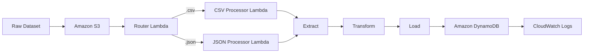

# 🚀 Stock/Crypto Data Serverless ETL Pipeline with CI/CD

<p align="center">
A production-style <b>Serverless ETL Pipeline</b> built on AWS that automatically extracts, transforms, and loads Stock/Crypto market data using Amazon S3, AWS Lambda, Amazon DynamoDB, and a complete CI/CD pipeline powered by GitHub Actions and AWS CodePipeline. Includes a <b>file-type based routing enhancement</b> that dynamically invokes a dedicated Lambda parser depending on whether the incoming file is CSV or JSON.
</p>

<p align="center">
  
  
  
  
</p>

<p align="center">
  
  
  
</p>

---

## 🏗️ Architecture Overview

```text
                    STOCK/CRYPTO SERVERLESS ETL PIPELINE

                                  GitHub
                                     │
                                     ▼
                           GitHub Actions (CI)
                            Validate •  Build
                                     │
                                     ▼
                             AWS CodeBuild
                          Install • Test • Package
                                     │
                                     ▼
                           AWS CodePipeline
                              Source & Build
                                     │
──────────────────────────────────────────────────────────────────────

Stock/Crypto Dataset (CSV / JSON)
             │
             ▼
      Amazon S3 Bucket
     (raw/ Data Storage)
             │
      S3 Object Created
             │
             ▼
      AWS Router Lambda
   (Detects File Extension)
             │
     ┌───────┴────────┐
     │                │
     ▼                ▼
 CSV Processor    JSON Processor
   Lambda            Lambda
     │                │
     └───────┬────────┘
             ▼
   Amazon DynamoDB Table
      (clean_records)
             │
             ▼
   Amazon CloudWatch Logs
      Metrics • Logs • Audit
```

---

## Project Overview

This project demonstrates a **Serverless ETL Pipeline** built on AWS for processing Stock and Cryptocurrency market data, enhanced with **file-type based Lambda routing**.

### Features

- Event-driven ETL using AWS Lambda
- Raw data stored in Amazon S3
- Clean records stored in Amazon DynamoDB
- File-type aware routing: a Router Lambda inspects the file extension and invokes the correct downstream parser Lambda
- Dedicated parsers for CSV and JSON data formats
- CloudWatch monitoring and audit logging
- GitHub Actions for CI
- AWS CodeBuild for build validation
- AWS CodePipeline for CI/CD automation

### Workflow

```text
Upload Dataset (CSV or JSON)
      │
      ▼
Amazon S3 (raw/)
      │
      ▼
Router Lambda (detects file type)
      │
      ├──► CSV Processor Lambda
      │
      └──► JSON Processor Lambda
      │
      ▼
Validate → Clean → Transform
      │
      ▼
Amazon DynamoDB
      │
      ▼
CloudWatch Logs
```

---

## ETL Workflow



| Stage | Description |
|--------|-------------|
| Route | Router Lambda detects file extension and invokes the matching parser Lambda |
| Extract | Read raw stock/crypto data from Amazon S3 |
| Transform | Validate, clean, standardize fields, and derive `price_category` |
| Load | Store processed records in DynamoDB with `source_type` (CSV/JSON) |
| Audit | Generate execution logs and audit summary in CloudWatch |

---

## AWS Services Used

| Service | Purpose |
|----------|---------|
| Amazon S3 | Store raw stock/crypto dataset (CSV & JSON) |
| AWS Lambda | Router, CSV processor, and JSON processor functions |
| Amazon DynamoDB | Store cleaned records (`clean_records` table) |
| Amazon CloudWatch | Monitor Lambda execution and audit logs |
| AWS IAM | Manage least-privilege permissions per function |
| GitHub | Source code management |
| GitHub Actions | Continuous Integration |
| AWS CodeBuild | Build validation |
| AWS CodePipeline | Continuous Delivery |

---

## Lambda Functions

| Function | Role |
|-----------|------|
| `stock-etl-router` | Triggered by S3; inspects file extension and invokes the matching processor |
| `stock-etl-csv-processor` | Parses, validates, and loads CSV stock/crypto records |
| `stock-etl-json-processor` | Parses, validates, and loads JSON stock/crypto records |

---

## DynamoDB Table Design

- **Table Name:** `clean_records`
- **Partition Key:** `record_id` (String)
- **Capacity Mode:** On-demand
- **Additional Fields:** `symbol`, `price`, `volume`, `currency`, `price_category`, `source_type`, `processed_at`

---

## Project Structure

```text
etl-s3-lambda-dynamodb/
│
├── .github/
│   └── workflows/
│       └── ci.yml
│
├── sample_data/
│   ├── sample_raw_data.csv
│   └── sample_raw_data.json
│
├── screenshots/
│   ├── s3.png
│   ├── cloudwatch.png
│   ├── dynamodb.png
│   ├── github-actions.png
│   └── codepipeline.png
│
├── lambda_function.py
├── router_lambda.py
├── csv_processor.py
├── json_processor.py
├── requirements.txt
├── buildspec.yml
├── .gitignore
└── README.md
```

---

## Project Screenshots

### Amazon S3 (Raw Dataset)

Raw stock/crypto dataset uploaded to Amazon S3 under the `raw/` prefix.

<p align="center">

</p>

---

### AWS Lambda Execution Logs

CloudWatch logs showing the Router Lambda detecting file type and routing to the correct processor Lambda.

<p align="center">

</p>

---

### Amazon DynamoDB

Processed records stored in the `clean_records` table, tagged with `source_type` (CSV/JSON).

<p align="center">

</p>

---

### GitHub Actions

Continuous Integration workflow executed successfully.

<p align="center">

</p>

---

### AWS CodePipeline

End-to-end CI/CD pipeline execution (Source → Build).

<p align="center">

</p>

---

## Running Locally

Clone the repository:

```bash
git clone https://github.com/AnkitVishwakarma4591/ETL-s3-lambda-dynamodb-StockCryptoData-.git
```

Move into the project directory:

```bash
cd ETL-s3-lambda-dynamodb-StockCryptoData-
```

Install dependencies:

```bash
pip install -r requirements.txt
```

Validate the Lambda functions locally:

```bash
python -m py_compile lambda_function.py
python -m py_compile router_lambda.py
python -m py_compile csv_processor.py
python -m py_compile json_processor.py
```

---

## 🚀 Future Improvements

- Schedule automated ETL execution using **Amazon EventBridge**.
- Add **Amazon SNS** notifications for build and pipeline events.
- Deploy infrastructure using **AWS CloudFormation** or **Terraform**.
- Improve reliability with comprehensive **unit tests**.
- Add an **XML processor Lambda** to extend the router pattern to a third file type.
- Package and deploy Lambda functions using **AWS SAM**.
- Add monitoring dashboards and alarms using **Amazon CloudWatch**.

---

## Author

**Ankit Vishwakarma**

- GitHub: https://github.com/AnkitVishwakarma4591

If you found this project helpful, consider giving it a ⭐ on GitHub.
